# 💎Multi-Sub Kiosk Project 💎

## 3. 깃 규칙

- main  merge는 간승기, 한규정 
- 작업은 각자 브랜치에서만 커밋한다.
- master 브랜치에서 절대 작업 금지.
- test 는 "devTest" 브랜치 명 이용해서 테스트 진행

## 1. 프로젝트 개요

- 멀티캠퍼스 AI플랫폼을 활용한 웹서비스개발 14회차 세미프로젝트 개발.
- 기본적인 CRUD 개념 및 기능 구현과 키오스크를 접목하여 공부하고 새로운 기능의 만드는데 중점을 둔다.
- 서브웨이 키오스크 화면 구현.
- 메뉴선택 결재 서비스 구현.
- 어드민페이지를 따로 구현하여 제품,고객 관리 및 매출현황 조회가 가능하도록 개발.

---

### 2. 프로젝트 개발 기간

- 6월 14일 ~ 6월 26일 총 13일간 개발을 진행 하였음.
- 14일 ~ 15 일 : 주제 선정 및 팀 회의
- 15일 ~ 17일 : 기본 ERD설계, 개발 환경 구축, GIt-hub 개설 및 DB 설계
- 17일 ~ 24일 : KIOSK 기능 구현 및 어드민 페이지 CRUD 기능 구현
- 25일 ~ 26일 : KIOSK CSS 통한 화면 개발 및 어드민 페이지 차트 구성.

----

### 3. 구성원

#### 간승기

- PM 역할 및 Service 화면 개발 및 키오스크 기능 구축

  - Back-End
    - 기본 ERD설계 및 DB 테이블 구축
    - 상품 결제시 DB Insert 구축

  - Front-End
    - 키오스크 화면 및 기능 설계
    - 메뉴 선택 페이지 개발
    - 토핑 선택 페이지 개발
    - 하단 장바구니 생성 개발

#### 한규정

- 키오스크 화면 및 기능 구축 및 어드민페이지 화면 셋팅 개발
- 기획서 및 PPT 문서 작성
  - Back-End
    - 선택한 상품에 대한 주문 목록 구현
    - 수량 선택 기능 구현
    - 수량에 대한 합계 가격 변격기능 및 총 합계 금액 기능 구현
  - Front-End
    - 장바구니(주문 목록) 화면 설계
    - 포장주문, 매장식사 선택 화면 설계
    - 신용카드, 카카오페이 선택 화면 설계

#### 윤나래

- 어드민페이지 상품 CRUD 개발
  - Back-End
    - Order Table DB 설계
    - Admin page 의 Product, Topping, Nutition CRUD 화면 연동 개발
    - Admin page의 Count 기능 개발

  - Front-End
    - Admin Page 메인 화면 구성 및 부트 스트랩 활용 설계
    - Admin page의 Count 기능 구성

#### 김유란

- 어드민페이지 회원, 쿠폰 CRUD개발 및 구성
  - Back-End
    - 관리자 페이지의 검색 기능 구현(고객, 직원, 제품, 쿠폰)
    - 고객, 직원, 쿠폰 CRUD 기능 개발
    - 차트 기능 구현
    - 로그인 기능 구현
      - 직원 로그인 통해 admin page 접속, 아이디, 비밀번호 유효성 검사

  - Front-End
    - 관리자 페이지 메인 화면 설계
      - 검색탁, 타츠, 로그인 화면 설계

    - 관리자 페이이지 고객, 직원 쿠폰, 등록, 수정, 조회 목록 화면 설계

---

### 4. 프로젝트 도구

- HW 장비
  - 노트북
  - VIEW용 테블릿 
- 개발 환경도구
  - Eclopse 
  - MySQL WorkBench
- 협업 도구
  - zoom
  - Discord
  - KakaoTalk
  - Gti-hub
  - ERD-Cloud
- 사용 프레임워크
  - Java SpringBoot
  - Mybatis
  - BootStrap
- 사용 언어 및 기능
  - Java
  - JavaScript
  - HTML
  - CSS
  - SQL
  - Ajax
  - jQuery
  - Thymleaf

### 5. ERD 설계

 - 복사본-16563057712121.png)

### 

### 6. 화면 동작 로직

#### 6-1 키오스크 동작 로직

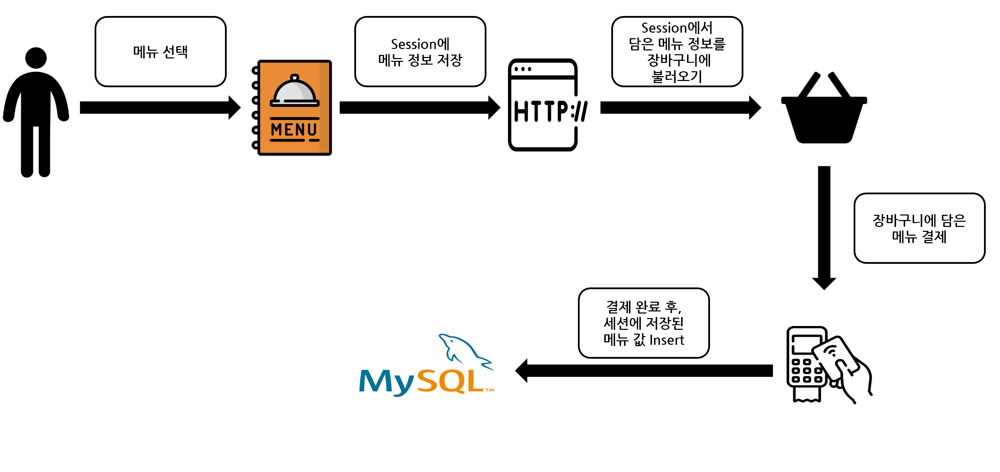

##### 1. 메뉴 선택화면

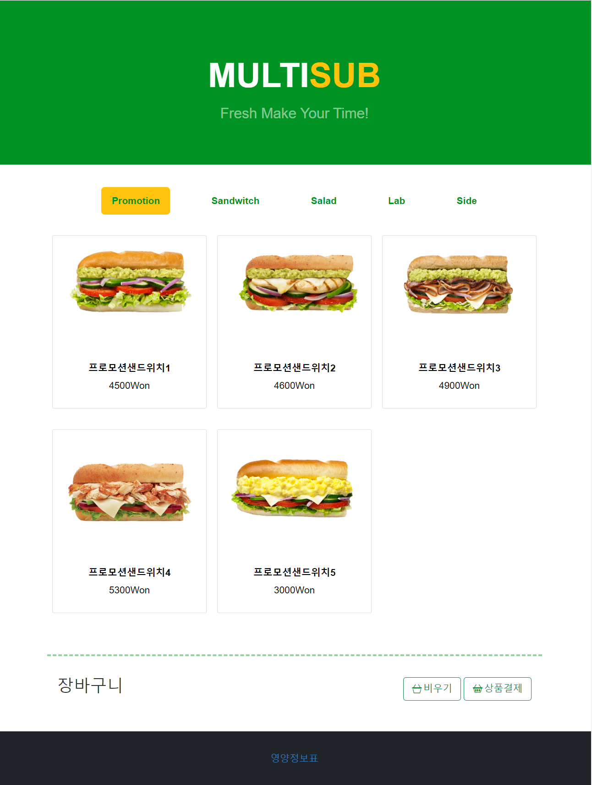

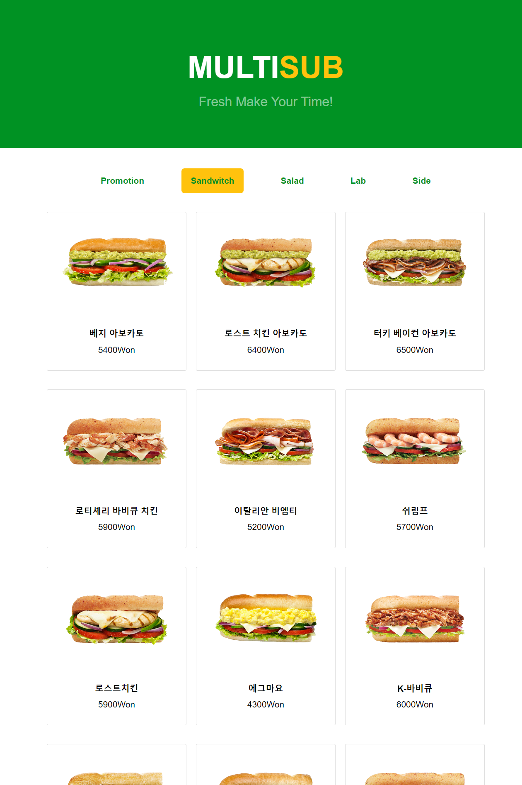

##### 2. 메뉴 선택 후 토핑 선택

###### 

- 메인 메뉴를 선택한 후 서브웨이 선택 메뉴 로직에따라 빵 -> 빵길이선택 -> 굽기선택 -> 치즈선택 -> 야채선택 -> 소스 선택 -> 추가 토핑 선택 순으로 진행을 한다.

###### 메뉴선택 시연 동영상 링크 

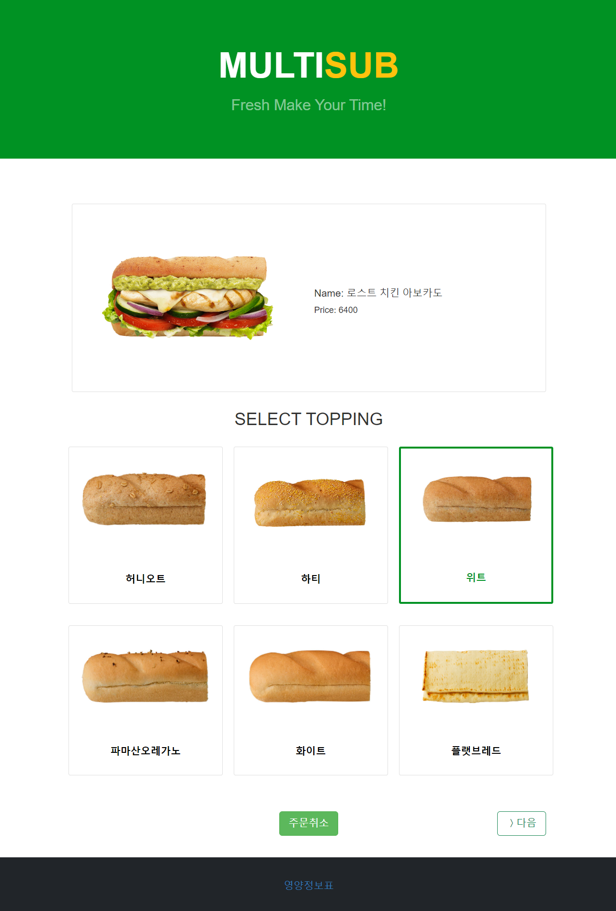

---

- 메뉴 선택 후 장바구니에 샌드위치는 담아지며 토핑이 선택된 값이 출력 된다.

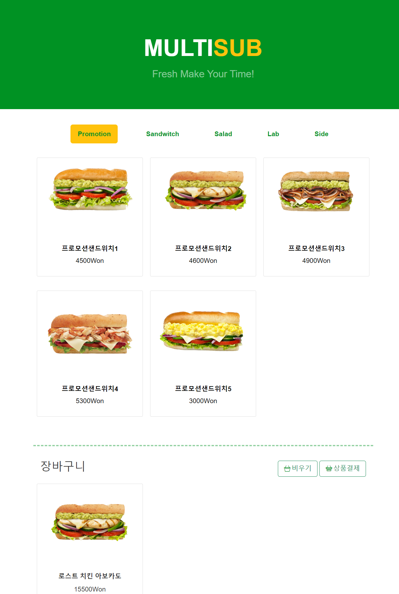

##### 

#####  

##### 3. 담은 메뉴 결제 화면.

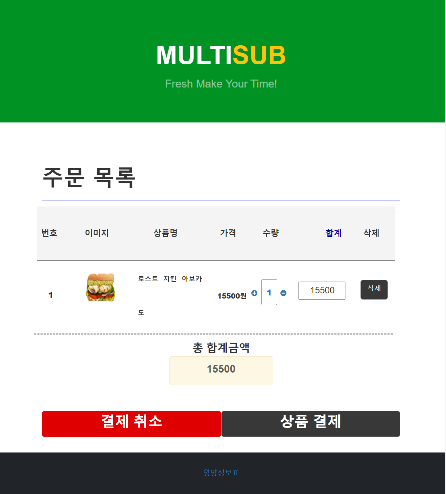

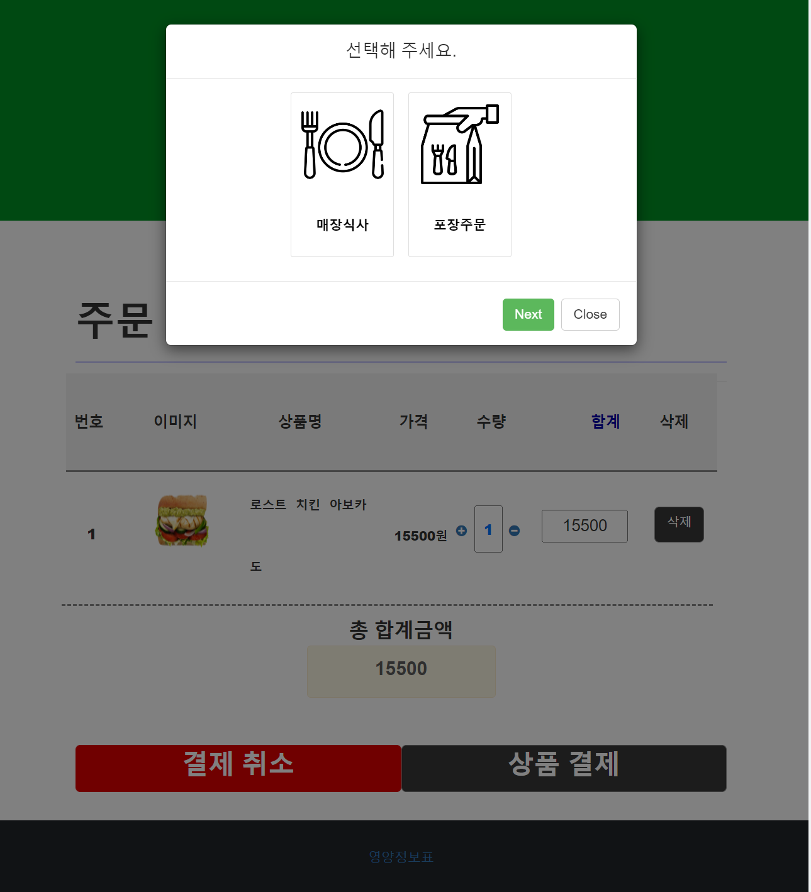

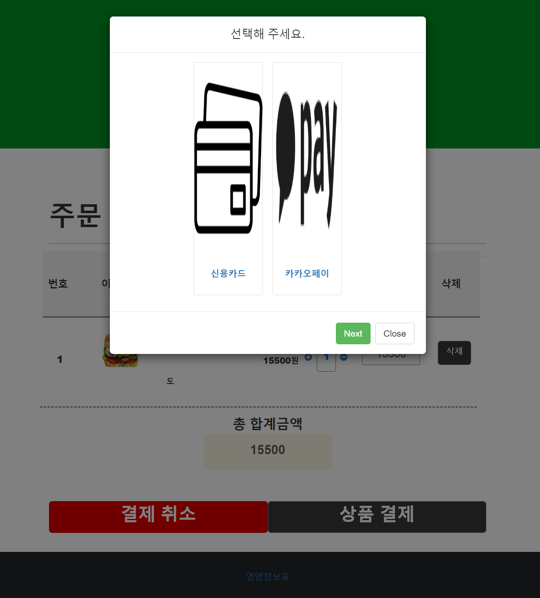

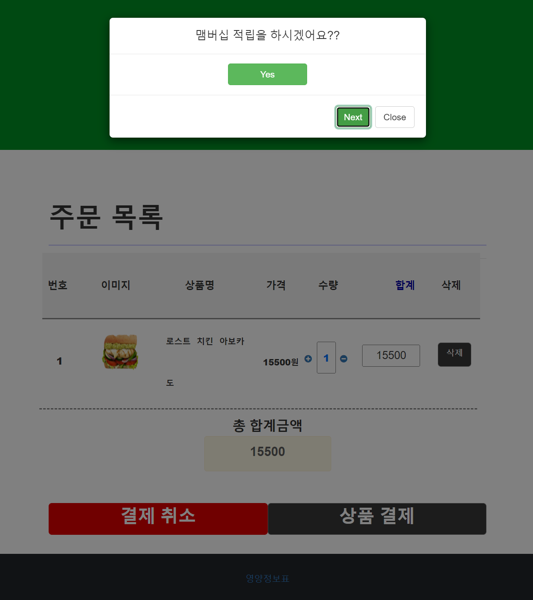

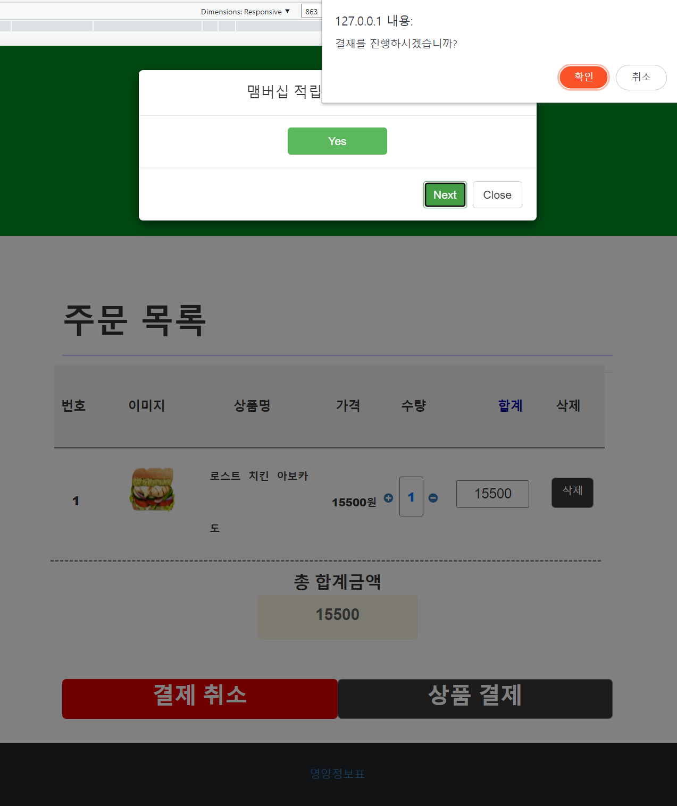

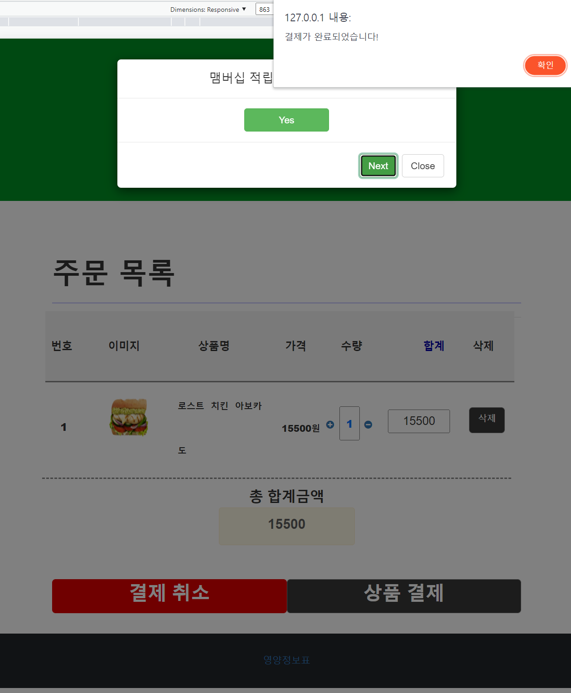

---

#####  6-2 어드민 페이지 동작 원리

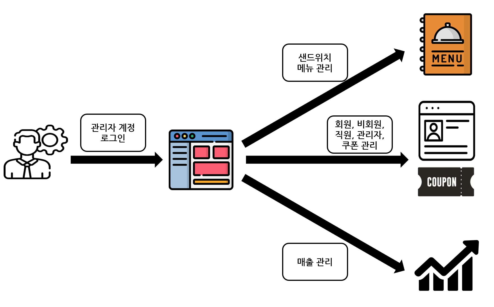

###### 1. 어드민 페이지 매출관리 및 상품 확인 페이지

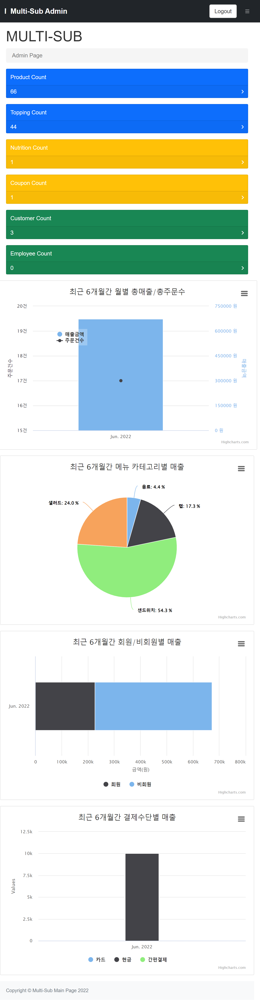
